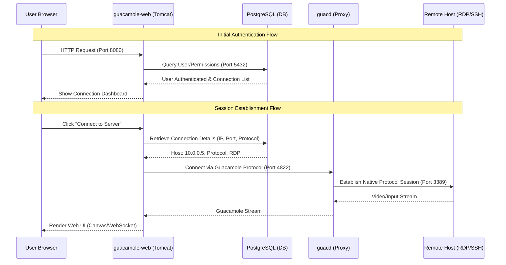

# K8s Project Architecture Overview

This document describes the high-level architecture, component communication, and port configurations for the Guacamole Kubernetes project.

## 1. Cluster Topology (Kind HA Setup)

The cluster is built using `kind` with a High Availability (HA) configuration consisting of multiple master and worker nodes.

| Node Name | Role | Image | Notes |
| :--- | :--- | :--- | :--- |
| `guacamole-cluster-control-plane` | Master | `kindest/node:v1.27.3` | Primary control plane node. |
| `guacamole-cluster-control-plane2` | Master | `kindest/node:v1.27.3` | Secondary control plane node. |
| `guacamole-cluster-worker` | Worker | `kindest/node:v1.27.3` | Application workload node (Worker 1). |
| `guacamole-cluster-worker2` | Worker | `kindest/node:v1.27.3` | Application workload node (Worker 2). |

### External Access
- **Load Balancer**: A Docker container `guacamole-cluster-external-load-balancer` acts as an external entry point for the HA API server.
- **Port Mapping**: Master 1 maps host port `30080` to container port `30080`.

---

## 2. Component Architecture

The application is composed of three main layers, all deployed on worker nodes.

## 2. Detailed Logic Flow

### Component Interaction Sequence
The following diagram illustrates the sequence of operations when a user logs in and starts a session.

---

## 3. Bootstrapping & Initialization Flow

Before the application is ready, a specific bootstrapping sequence occurs involving the `init-job`.

### The "Init Job" Role
The `guacamole-init-db` job ensures the database schema is ready before the web app starts.

1.  **Phase 1 (initContainer)**: Runs `guacamole/guacamole` image to execute `initdb.sh`. This generates the required SQL schema for PostgreSQL and saves it to a shared volume.
2.  **Phase 2 (container)**: Runs `postgres` image and uses `psql` to execute the generated SQL against the living `postgres` service.
3.  **Completion**: Once the job finishes (`status: Completed`), the `guacamole-web` pods can successfully connect and find the required tables.

---

## 4. Kubernetes Networking & DNS Resolution

The architecture leverages Kubernetes-native networking for seamless communication.

### Internal DNS Resolution
- **Service-Based Discovery**: Components do not use hardcoded IPs. They use Kubernetes service names defined in the manifests.
- **Headless Services**: Both `guacd` and `postgres` are defined with `clusterIP: None` (Headless). 
  - **Why?** This allows `guacamole-web` to get the direct Pod IPs of all healthy `guacd` or `postgres` instances via DNS, enabling more direct communication or client-side load balancing.

### Port Mapping & External Access
| Interaction | Type | Endpoint |
| :--- | :--- | :--- |
| **User -> Web** | NodePort | `172.18.0.3:31232` (Worker IP : NodePort) |
| **Web -> guacd** | Internal | `guacd.default.svc.cluster.local:4822` |
| **Web -> DB** | Internal | `postgres.default.svc.cluster.local:5432` |

---

## 5. Live Environment Status (Live Data)
... (Previous content below)

Inside the cluster, components communicate using service names (K8s DNS).

### Network Summary (Live Data)

| Source | Destination | Protocol | Port | Destination IP/Hostname |
| :--- | :--- | :--- | :--- | :--- |
| **External User** | `guacamole-web` | TCP | 8080 | NodePort `31232` or Port-Forward |
| **guacamole-web** | `guacd` | TCP | 4822 | Service: `guacd` (Headless) |
| **guacamole-web** | `postgres` | TCP | 5432 | Service: `postgres` (Headless) |

### Node & Service IP Details (Live Status)

| Resource | Role / Type | Internal IP | External IP |
| :--- | :--- | :--- | :--- |
| **kind-control-plane** | Master | `172.18.0.4` | `<none>` |
| **kind-control-plane2** | Master | `172.18.0.5` | `<none>` |
| **kind-worker** | Worker | `172.18.0.3` | `<none>` |
| **kind-worker2** | Worker | `172.18.0.6` | `<none>` |
| **guacamole-web** | LoadBalancer | `10.96.202.193` | `<pending>` |
| **guacd** | ClusterIP (None) | `None` | `<none>` |
| **postgres** | ClusterIP (None) | `None` | `<none>` |

### Pod Communication (Direct Access)

| Pod Name | Cluster Node | Pod IP |
| :--- | :--- | :--- |
| `guacamole-web-*` | `kind-worker` / `kind-worker2` | `10.244.2.3`, `10.244.3.3` |
| `guacd-*` | `kind-worker` / `kind-worker2` | `10.244.2.2`, `10.244.3.2` |
| `postgres-0` | `kind-worker2` | `10.244.3.5` |

---

## 4. Environment Configuration
Configuration is passed via environment variables in [guacamole-web.yaml](file:///home/jilani/k8s/guacamole/guacamole-web.yaml):
- `GUACD_HOSTNAME`: `guacd`
- `GUAC_PORT`: `4822`
- `POSTGRESQL_HOSTNAME`: `postgres`
- `POSTGRESQL_DATABASE`: `guacamole_db` (from secret)

> [!NOTE]
> Service communication inside the cluster uses Kubernetes DNS names (`guacd`, `postgres`) which resolve to the Pod IPs directly because they are defined as Headless Services.
