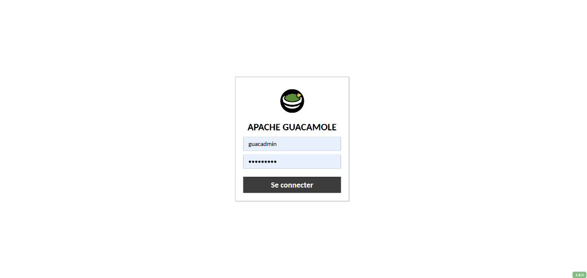
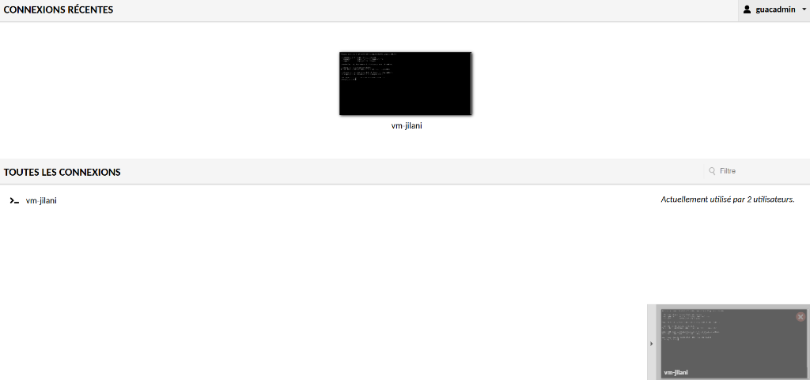
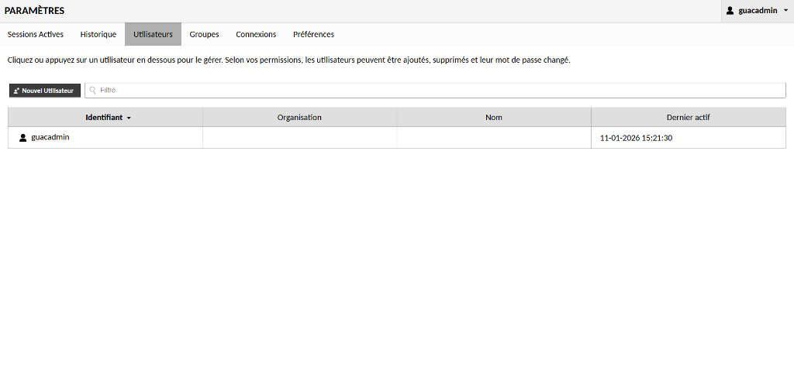
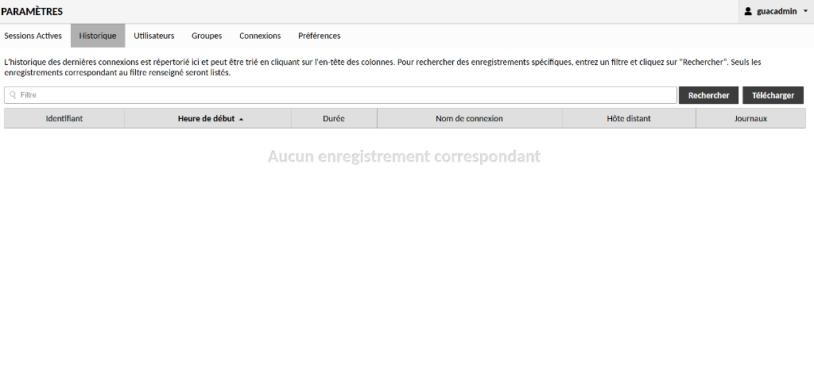
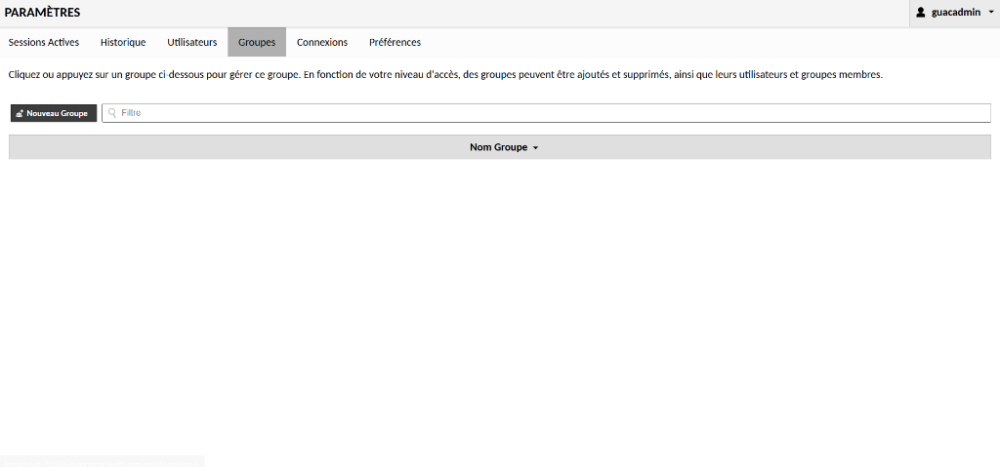
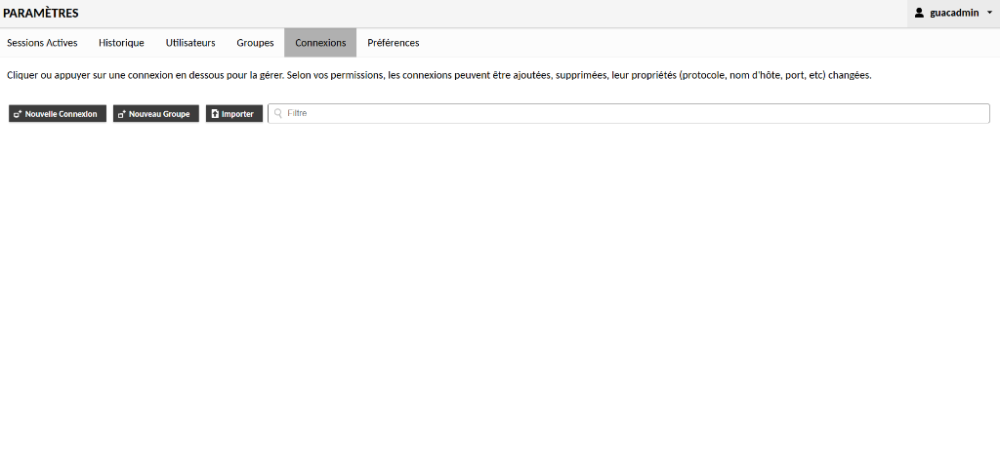
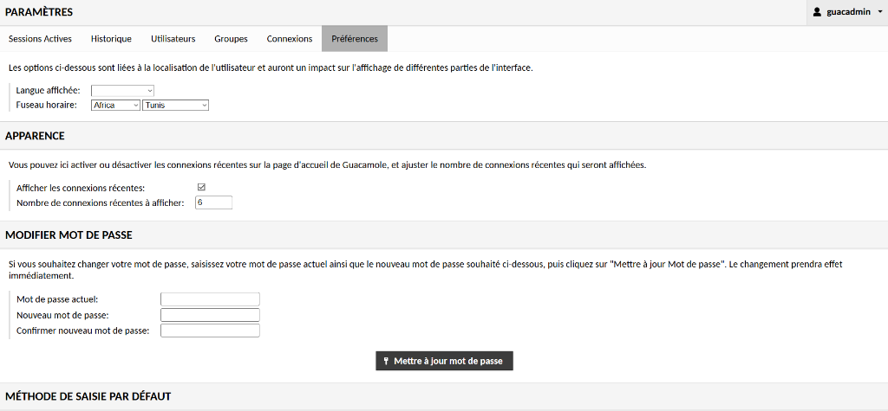
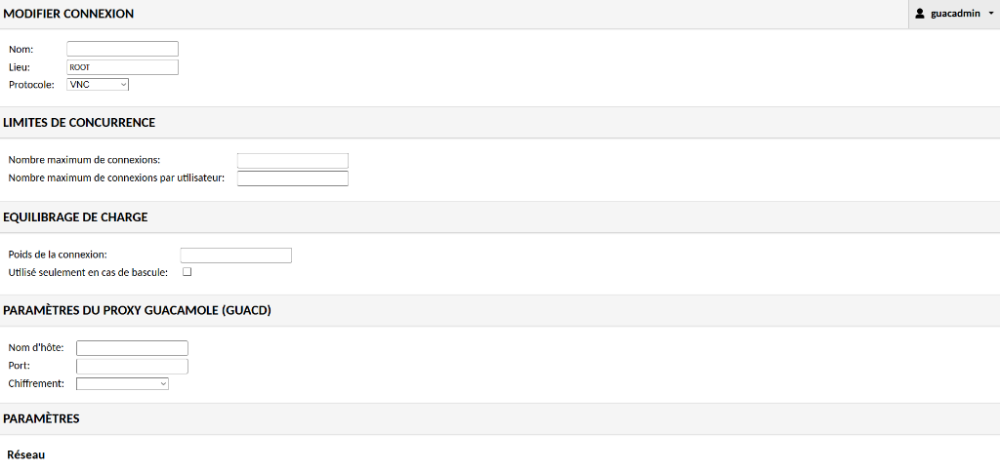
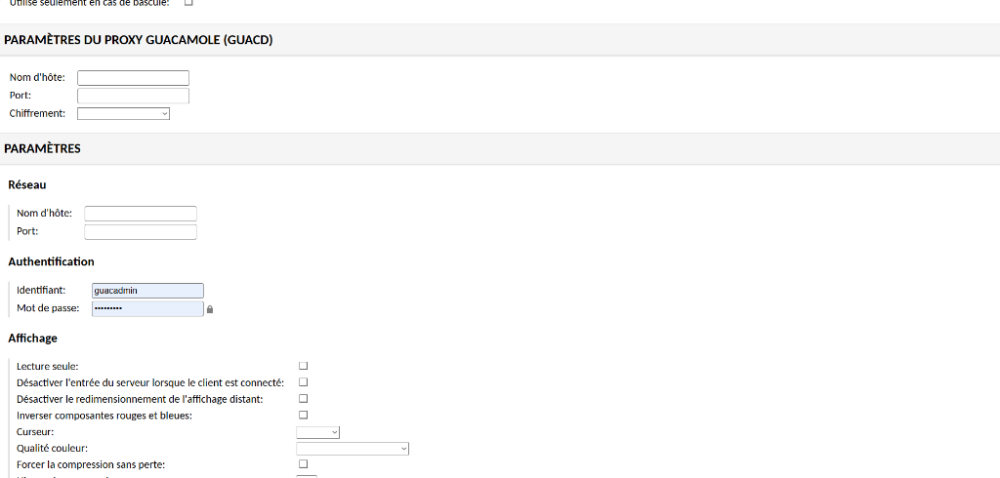
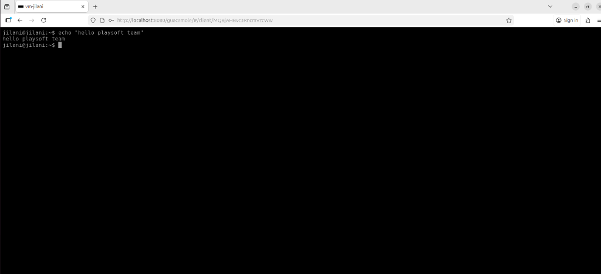

# Apache Guacamole on Kubernetes (Kind) - Setup Guide

This guide provides step-by-step instructions to set up a High Availability Kubernetes cluster using `kind` and deploy Apache Guacamole with a persistent PostgreSQL database.

## 1. Prerequisites

Ensure you have the following installed on your machine:
*   **Docker**: The container runtime.
*   **kubectl**: The Kubernetes command-line tool.
*   **kind**: Kubernetes in Docker.

### Install `kind` (if not installed)
```bash
# Linux
curl -Lo ./kind https://kind.sigs.k8s.io/dl/v0.20.0/kind-linux-amd64
chmod +x ./kind
sudo mv ./kind /usr/local/bin/kind
```

## 2. Create the HA Cluster

1.  Create a configuration file named `kind-config.yaml` with the following content. This sets up a cluster with 2 control-plane nodes and 2 worker nodes.

    ```yaml
    kind: Cluster
    apiVersion: kind.x-k8s.io/v1alpha4
    nodes:
    # Master 1
    - role: control-plane
      image: kindest/node:v1.27.3
      kubeadmConfigPatches:
      - |
        kind: InitConfiguration
        nodeRegistration:
          kubeletExtraArgs:
            node-labels: "node-type=master"
      extraPortMappings:
      - containerPort: 30080
        hostPort: 30080
        protocol: TCP
    # Master 2
    - role: control-plane
      image: kindest/node:v1.27.3
      kubeadmConfigPatches:
      - |
        kind: JoinConfiguration
        nodeRegistration:
          kubeletExtraArgs:
            node-labels: "node-type=master"
    # Worker 1
    - role: worker
      image: kindest/node:v1.27.3
      kubeadmConfigPatches:
      - |
        kind: JoinConfiguration
        nodeRegistration:
          kubeletExtraArgs:
            node-labels: "node-type=worker,node-name=worker-1"
    # Worker 2
    - role: worker
      image: kindest/node:v1.27.3
      kubeadmConfigPatches:
      - |
        kind: JoinConfiguration
        nodeRegistration:
          kubeletExtraArgs:
            node-labels: "node-type=worker,node-name=worker-2"
    ```

    *Note: If you want to map ports for direct access (e.g., NodePort), you can add `extraPortMappings` to the node configuration.*

2.  Create the cluster:
    ```bash
    kind create cluster --config kind-config.yaml --name guacamole-cluster
    ```

3.  Verify the cluster:
    ```bash
    kubectl get nodes
    ```

## 3. Deployment Directory Structure
Ensure your `k8s` directory has a `guacamole` folder with the following manifests (as created during this session):

*   `guacamole/postgres.yaml` (Database StatefulSet)
*   `guacamole/init-job.yaml` (Database Initialization Job)
*   `guacamole/guacd.yaml` (Guacamole Proxy)
*   `guacamole/guacamole-web.yaml` (Guacamole Web Application)

## 4. Deploy Apache Guacamole

Run the following commands in order:

### Step 1: Deploy PostgreSQL
This sets up the persistent database.
```bash
kubectl apply -f guacamole/postgres.yaml
```
*Wait until the postgres pod is Running:*
```bash
kubectl get pods -l app=postgres
```

### Step 2: Initialize Database
Run the initialization job to create the schema.
```bash
kubectl apply -f guacamole/init-job.yaml
```
*Wait for the job to complete (status 1/1):*
```bash
kubectl get jobs
```

### Step 3: Deploy Guacamole Components
Deploy the proxy (`guacd`) and the web application.
```bash
kubectl apply -f guacamole/guacd.yaml
kubectl apply -f guacamole/guacamole-web.yaml
```

## 5. Verify and Access

1.  Check pod status:
    ```bash
    kubectl get pods
    ```
    Ensure all pods are in `Running` state (note: `guacamole-init-db` will be `Completed`).

2.  Access the application:
    For a local Kind cluster, use port-forwarding:
    ```bash
    kubectl port-forward svc/guacamole-web 8080:8080
    ```

3.  Open in Browser:
    http://localhost:8080/guacamole/

    *   **Default Username**: `guacadmin`
    *   **Default Password**: `guacadmin`

## 6. Verify Guacamole is Running on Worker Nodes

To check if Guacamole pods are deployed on your worker nodes, use the following commands:

### Quick Check - Pod Distribution
```bash
# See which nodes all pods are running on
kubectl get pods -o wide
```
This shows the `NODE` column indicating which node each pod is running on.

### Detailed Check - Guacamole Pods Only
```bash
# Check guacamole-web pods specifically
kubectl get pods -l app=guacamole-web -o wide

# Check guacd (proxy) pods
kubectl get pods -l app=guacd -o wide

# Check postgres pods
kubectl get pods -l app=postgres -o wide
```

### Filter by Worker Nodes
```bash
# List all pods running on worker nodes
kubectl get pods -o wide --field-selector spec.nodeName=guacamole-cluster-worker
kubectl get pods -o wide --field-selector spec.nodeName=guacamole-cluster-worker2
```

### Count Pods per Node
```bash
# See how many pods are on each node
kubectl get pods -o json | jq -r '.items[] | .spec.nodeName' | sort | uniq -c
```

### Detailed Node Information
```bash
# See all pods on each node with resource usage
kubectl describe node guacamole-cluster-worker
kubectl describe node guacamole-cluster-worker2
```

### Expected Output
With your current configuration (2 replicas of guacamole-web), you should see:
- **guacamole-web**: 2 pods distributed across worker nodes
- **guacd**: 1 pod on a worker node
- **postgres**: 1 pod (can be on control-plane or worker)

**Note**: By default, Kubernetes scheduler distributes pods across available nodes. If you want to **force** Guacamole to run only on worker nodes, you can add `nodeSelector` or `nodeAffinity` to your deployment manifests.

### Check Master (Control-Plane) Nodes

To see what's running on your master/control-plane node:

```bash
# See all pods on control-plane node (includes system pods)
kubectl get pods -o wide --all-namespaces --field-selector spec.nodeName=guacamole-cluster-control-plane

# Check only system pods
kubectl get pods -n kube-system -o wide

# See node details and taints
kubectl describe node guacamole-cluster-control-plane

# Check node taints (what prevents scheduling)
kubectl get nodes -o custom-columns=NAME:.metadata.name,TAINTS:.spec.taints
```

#### What Runs on Master Nodes?

The control-plane node runs **Kubernetes system components** only:

**Core Control Plane Components:**
- `kube-apiserver` - API server for cluster communication
- `kube-controller-manager` - Manages controllers
- `kube-scheduler` - Schedules pods to nodes
- `etcd` - Cluster state database

**Networking & DNS:**
- `coredns` - DNS service (2 replicas)
- `kube-proxy` - Network proxy
- `kindnet` - CNI network plugin

**Storage:**
- `local-path-provisioner` - Dynamic volume provisioner

#### Why No Guacamole on Master?

The master node has a **NoSchedule taint** (`node-role.kubernetes.io/control-plane:NoSchedule`), which prevents application pods from being scheduled there. This is a Kubernetes best practice to:
- Keep the control plane isolated from application workloads
- Ensure cluster stability and performance
- Prevent resource contention

Your Guacamole application pods will **only run on worker nodes** unless you explicitly remove the taint or add tolerations to your deployments.

## 7. Accessing Nodes (Shell Access)

To enter the shell of your Kubernetes nodes (since they are Docker containers), use the `docker exec` command:

### Access Worker Nodes
```bash
# Enter Worker 1
docker exec -it guacamole-cluster-worker bash

# Enter Worker 2
docker exec -it guacamole-cluster-worker2 bash
```

### Access Master (Control-Plane) Nodes
```bash
# Enter Master 1
docker exec -it guacamole-cluster-control-plane bash

# Enter Master 2
docker exec -it guacamole-cluster-control-plane2 bash
```

### Why use Docker?
In a `kind` cluster, each node is a container. Running `docker exec -it [node-name] bash` is equivalent to logging into a physical server via SSH. From inside the node, you can run commands like `crictl ps` to see the containers running within that specific node.

## 8. Restarting after Reboot

If you restart your VM, follow these steps to get everything running again:

1.  **Ensure Docker is Running**:
    ```bash
    sudo systemctl status docker
    # If not running:
    sudo systemctl start docker
    ```

2.  **Check Cluster Status**:
    ```bash
    kind get clusters
    ```
    *   If you see `guacamole-cluster`, your cluster exists.
    *   If it's empty, you must recreate the cluster (Step 2 in this guide).

3.  **Ensure Load Balancer is Running**:
    If you are using an HA setup, the external load balancer container may need manual starting:
    ```bash
    docker start guacamole-cluster-external-load-balancer
    ```

4.  **Restore kubectl Connection**:
    If the cluster exists, restore the connection:
    ```bash
    kind export kubeconfig --name guacamole-cluster
    ```

5.  **Check Pods**:
    Wait a few minutes for the cluster to start up pods.
    ```bash
    kubectl get pods
    ```

6.  **Re-enable Access**:
    The port-forwarding stops when the terminal closes or machine reboots. Run it again:
    ```bash
    kubectl port-forward svc/guacamole-web 8080:8080
    ```

## 9. Cleanup
To delete the entire cluster:
```bash
kind delete cluster --name guacamole-cluster
```

## 10. Screenshots

### Login Screen


### Home Dashboard (Recent Connections)


### User Management


### Active Sessions


### Connection History


### Group Management


### Connection Settings


### User Preferences


### Connection - Concurrency & Load Balancing


### Connection - Guacd Proxy Parameters


### Connection - Authentication & Display


### Connection - SFTP & Audio


### Active Terminal Session

