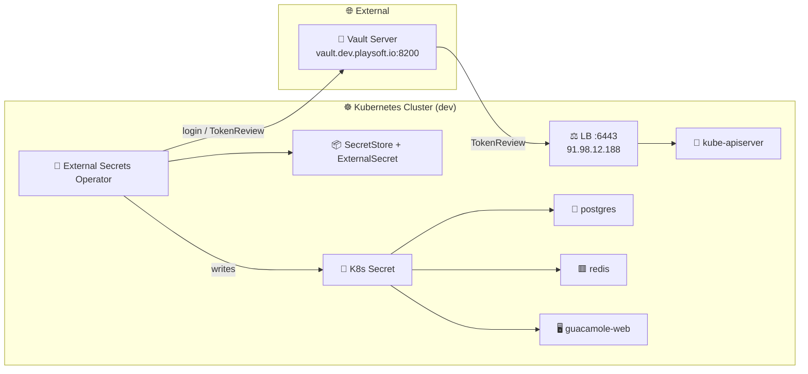
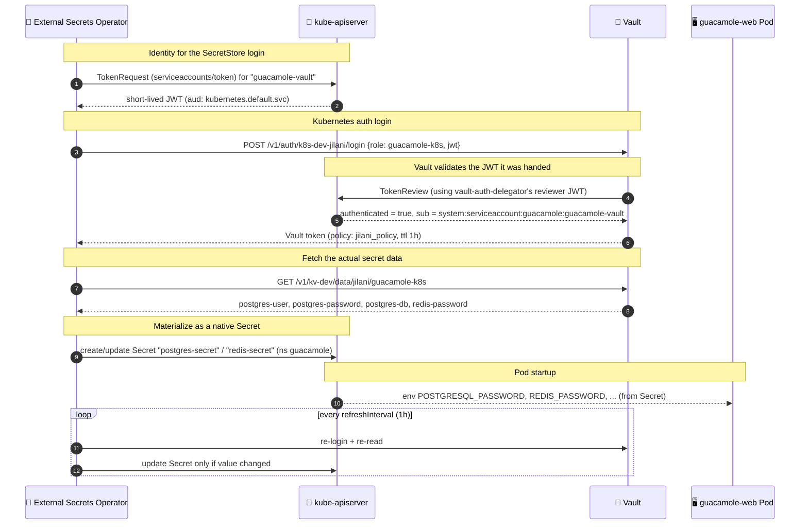

# Vault → Kubernetes Secret Integration (Guacamole)

How HashiCorp Vault feeds credentials into the `guacamole` namespace via the
External Secrets Operator (ESO), with zero secrets stored in Git or in the
cluster's manifests.

---

## 1. Architecture

```mermaid
architecture-beta
    group ext(logos:hashicorp-icon)[External Services]
    group k8s(logos:kubernetes)[Kubernetes Cluster dev]

    service vault(logos:vault-icon)[Vault Server] in ext

    service lb(internet)[LB 91 98 12 188] in k8s
    service api(server)[kube apiserver] in k8s
    service eso(mdi:sync-circle)[External Secrets Operator] in k8s
    service ss(disk)[SecretStore and ExternalSecret] in k8s
    service sec(mdi:key-variant)[K8s Secret] in k8s
    service pg(logos:postgresql)[postgres Pod] in k8s
    service rd(logos:redis)[redis Pod] in k8s
    service web(mdi:monitor)[guacamole web Pod] in k8s

    lb:T --> B:api
    eso:R --> L:vault
    eso:T --> B:ss
    eso:B --> T:sec
    sec:R --> L:pg
    sec:R --> L:rd
    sec:B --> T:web
    vault:B --> T:lb
```



> If your viewer doesn't auto-load Iconify icon packs (offline VS Code
> preview, plain GitHub render), use this fallback — same diagram, emoji
> instead of brand icons:



---

## 2. Sequence — how a secret actually gets to a pod



---

## 3. Components & responsibilities

| Component | Manifest | Role |
|---|---|---|
| `guacamole-vault` ServiceAccount | [07-vault-secrets.yaml](07-vault-secrets.yaml) | Identity ESO assumes to log in to Vault |
| `guacamole-vault-token` Role/RoleBinding | [07-vault-secrets.yaml](07-vault-secrets.yaml) | Lets ESO's own SA mint tokens *for* `guacamole-vault` |
| `vault-backend` SecretStore | [07-vault-secrets.yaml](07-vault-secrets.yaml) | Vault connection: address, KV mount, auth method/role |
| `postgres-secret` / `redis-secret` ExternalSecret | [07-vault-secrets.yaml](07-vault-secrets.yaml) | Maps Vault KV properties → K8s Secret keys |
| `vault-auth-delegator` ServiceAccount + ClusterRoleBinding | [08-vault-auth.yaml](08-vault-auth.yaml) | Identity **Vault** uses to call TokenReview against this cluster |
| Vault `auth/k8s-dev-jilani` | configured on Vault server | Kubernetes auth method instance for this cluster |
| Vault `guacamole-k8s` role | configured on Vault server | Binds SA `guacamole-vault`/ns `guacamole` to `jilani_policy` |
| Vault `jilani_policy` | configured on Vault server | Grants read on `kv-dev/data/jilani/*` |

---

## 4. Step-by-step setup

### Step 0 — Prerequisites
- External Secrets Operator already running in-cluster (`kubectl get pods -n default -l app.kubernetes.io/name=external-secrets`).
- Network reachability from Vault to the cluster's API server, and from the cluster to Vault (`curl https://<vault-addr>:8200/v1/sys/health`).

### Step 1 — Namespaces
```bash
kubectl create namespace guacamole
kubectl create namespace vault
```

### Step 2 — K8s identity ESO uses to authenticate to Vault
Defines `guacamole-vault` SA and the RBAC that lets ESO mint tokens for it
([07-vault-secrets.yaml:1-19](07-vault-secrets.yaml#L1-L19)):
```bash
kubectl apply -f 07-vault-secrets.yaml
```

### Step 3 — Bootstrap identity Vault uses to validate logins
`vault-auth-delegator` is **not** a per-app credential — it's the one-time
identity Vault calls TokenReview with whenever *any* workload SA tries to log
in ([08-vault-auth.yaml](08-vault-auth.yaml)):
```bash
kubectl apply -f 08-vault-auth.yaml
```

### Step 4 — Make sure the API server's TLS cert covers how Vault reaches it
⚠️ **Real gotcha hit during this integration:** if Vault reaches the cluster
through a load balancer, the apiserver's serving cert must list the LB's IP
in its SAN list, or Vault's TLS handshake fails silently as a generic
`403 permission denied` — indistinguishable from an RBAC error.

```bash
# add the LB IP(s) to the kubeadm ClusterConfiguration
kubectl -n kube-system edit configmap kubeadm-config   # apiServer.certSANs: add LB IP(s)

# on every control-plane node:
mv /etc/kubernetes/pki/apiserver.{crt,key} /root/pki-backup/
kubeadm init phase certs apiserver --config <config-with-certSANs>
crictl ps | grep kube-apiserver        # find sandbox id
crictl stopp <SANDBOX_ID>              # kubelet recreates it with the new cert
```

### Step 5 — Configure Vault's Kubernetes auth method
```bash
vault auth enable -path=k8s-dev-jilani kubernetes   # if not already enabled

vault write auth/k8s-dev-jilani/config \
  token_reviewer_jwt="<vault-auth-delegator token, ns: vault>" \
  kubernetes_host="https://<cluster-LB-IP>:6443" \
  kubernetes_ca_cert="<cluster CA cert>"
```

### Step 6 — Vault policy + role
```bash
vault policy write jilani_policy - <<'EOF'
path "kv-dev/data/jilani/*" {
  capabilities = ["create", "read", "update", "list"]
}
path "kv-dev/metadata/jilani/*" {
  capabilities = ["create", "read", "update", "list"]
}
EOF

vault write auth/k8s-dev-jilani/role/guacamole-k8s \
  bound_service_account_names=guacamole-vault \
  bound_service_account_namespaces=guacamole \
  policies=jilani_policy \
  ttl=1h
```

### Step 7 — Put the actual secret data in Vault
```bash
vault kv put kv-dev/jilani/guacamole-k8s \
  postgres-user=guacuser \
  postgres-password='<password>' \
  postgres-db=guacdb \
  redis-password='<password>'
```

### Step 8 — SecretStore + ExternalSecret (already in [07-vault-secrets.yaml](07-vault-secrets.yaml))
```yaml
spec:
  provider:
    vault:
      server: "https://vault.dev.playsoft.io:8200"
      path: "kv-dev"
      version: "v2"
      auth:
        kubernetes:
          mountPath: "k8s-dev-jilani"
          role: "guacamole-k8s"
          serviceAccountRef:
            name: guacamole-vault
```
```bash
kubectl apply -f 07-vault-secrets.yaml
```

### Step 9 — Verify
```bash
kubectl get secretstore vault-backend -n guacamole          # READY: True
kubectl get externalsecret -n guacamole                     # STATUS: SecretSynced
kubectl get secret postgres-secret redis-secret -n guacamole
```

### Step 10 — Consume in workloads
Pods never talk to Vault directly — they read a normal `Secret` via
`env.valueFrom.secretKeyRef` (see `03-guacamole-web.yaml`, `01-postgres.yaml`,
`05-redis.yaml`).

---

## 5. Live verification trick (prove it's not stale)

```bash
# change a value in Vault
vault kv patch kv-dev/jilani/guacamole-k8s postgres-password=rotated-value

# force ESO to reconcile immediately instead of waiting for refreshInterval
kubectl annotate externalsecret postgres-secret -n guacamole force-sync="$(date +%s)" --overwrite

# confirm the K8s Secret picked it up
kubectl get secret postgres-secret -n guacamole -o jsonpath='{.data.postgres-password}' | base64 -d
```

---

## 6. Key takeaways for the talk

- **No secrets in Git** — manifests only ever reference Vault *paths*, never values.
- **Two distinct identities, easy to confuse**: `guacamole-vault` (the app's
  identity, used to *log in*) vs. `vault-auth-delegator` (Vault's own
  identity, used to *validate* logins). Mixing these up is the #1 source of
  confusing 403s.
- **TLS, not just RBAC, gates the kubernetes auth method.** A generic
  `403 permission denied` from Vault can mean "bad role binding" *or*
  "TLS handshake failed" — they're indistinguishable without checking the
  apiserver cert's SAN list against whatever address Vault was actually
  given.
- **Rotation is push-button**: changing a value in Vault propagates to
  running pods within one `refreshInterval`, with no redeploy.
