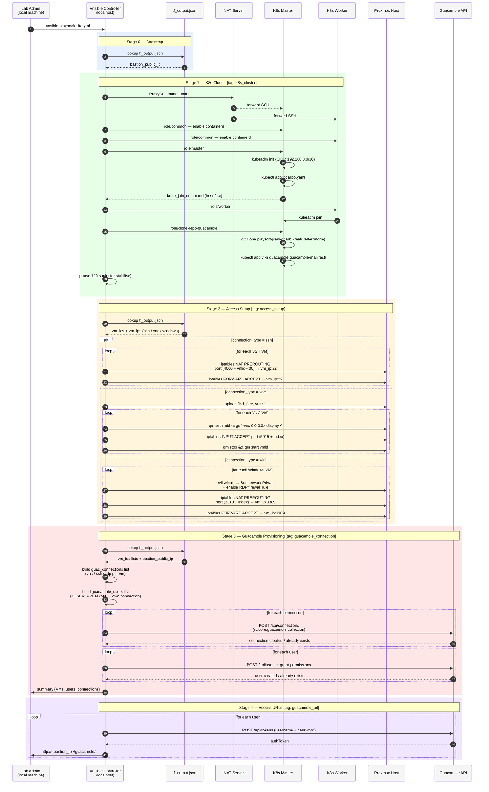
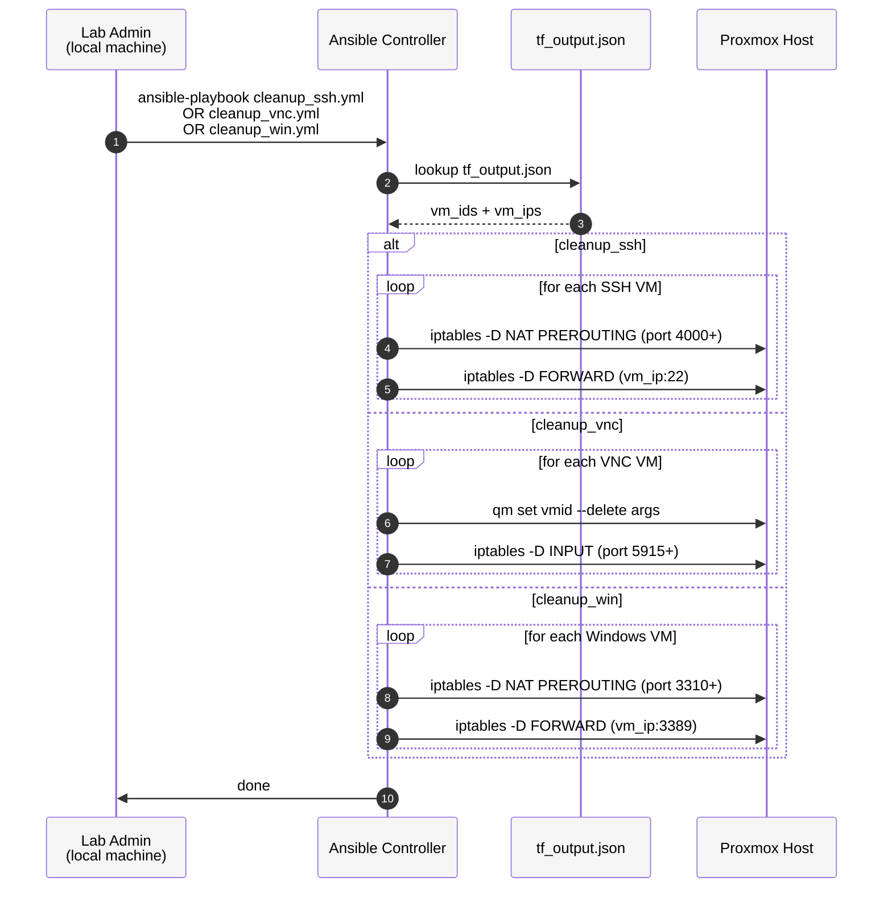

# Sequence Diagram — Global Ansible Flow

---

## Step-by-step Explanation

### Stage 0 — Bootstrap

| # | Description |
|---|---|
| 1 | The Lab Admin runs `ansible-playbook site.yml` from their local machine to start the full provisioning. |
| 2 | The Ansible Controller reads `tf_output.json` produced by Terraform to retrieve infrastructure details. |
| 3 | The file returns `bastion_public_ip`, used later to build all Guacamole API URLs. |

### Stage 1 — K8s Cluster

| # | Description |
|---|---|
| 4 | Ansible opens an SSH tunnel through the NAT server using `ProxyCommand` to reach the private K8s network. |
| 5 | The NAT server forwards the SSH connection to the K8s master node. |
| 6 | The NAT server forwards the SSH connection to the K8s worker node. |
| 7 | The `common` role runs on the master — enables and starts the `containerd` container runtime. |
| 8 | The `common` role runs on the worker — same containerd setup. |
| 9 | The `master` role is applied to the master node to initialise the control plane. |
| 10 | `kubeadm init` bootstraps the cluster with pod CIDR `192.168.0.0/16`. |
| 11 | Calico CNI is installed as the cluster network plugin via `kubectl apply`. |
| 12 | The generated `kubeadm join` command is stored as a host fact and shared with the Ansible Controller. |
| 13 | The `worker` role is applied — instructs the worker to join the cluster. |
| 14 | The worker node runs `kubeadm join` using the token provided by the master. |
| 15 | The `clone-repo-guacamole` role runs on the master to deploy the Guacamole application. |
| 16 | The project repository is cloned into `/guacamole/` on the master node. |
| 17 | Guacamole Kubernetes manifests (namespace, postgres, guacd, web, init-job) are applied in the `guacamole` namespace. |
| 18 | Ansible pauses 120 seconds to allow the cluster and Guacamole pods to reach a ready state. |

### Stage 2 — Access Setup

| # | Description |
|---|---|
| 19 | Ansible re-reads `tf_output.json` to get the list of provisioned VM IDs and IPs per connection type. |
| 20 | The file returns VM IDs and IPs for SSH, VNC, and/or Windows VMs depending on what Terraform created. |
| 21 **(ssh)** | For each SSH VM: a NAT PREROUTING iptables rule is added on Proxmox, forwarding `4000+(vmid-400)` → `vm_ip:22`. |
| 22 **(ssh)** | A FORWARD rule is added to allow the forwarded SSH traffic to reach the VM. |
| 21 **(vnc)** | `find_free_vnc.sh` is uploaded to Proxmox — scans ports to find free VNC display slots. |
| 22 **(vnc)** | For each VNC VM: `qm set` applies a `-vnc` argument so the VM exposes a VNC server on a deterministic port. |
| 23 **(vnc)** | An iptables INPUT rule opens the corresponding TCP port (`5915+index`) on Proxmox. |
| 24 **(vnc)** | The VM is restarted (`qm stop && qm start`) to apply the VNC argument change. |
| 21 **(win)** | For each Windows VM: Ansible connects via Evil-WinRM and runs PowerShell to set the network profile to Private and enable the RDP firewall rule. |
| 22 **(win)** | A NAT PREROUTING rule is added forwarding `3310+index` → `vm_ip:3389`. |
| 23 **(win)** | A FORWARD rule is added to allow the RDP traffic through to the VM. |

### Stage 3 — Guacamole Provisioning

| # | Description |
|---|---|
| 30 | Ansible re-reads `tf_output.json` to get VM IDs and the bastion public IP for the Guacamole API base URL. |
| 31 | Returns the full VM ID lists for all connection types plus the bastion IP. |
| 32 | The controller builds the list of Guacamole connections (name, protocol, hostname, port) for each VM. |
| 33 | The controller builds the list of Guacamole users (`<USER_PREFIX>N`) each mapped to their own connection. |
| 34 | For each connection, a `POST /api/connections` call is made to the Guacamole API via the `scicore.guacamole` collection. |
| 35 | Guacamole confirms the connection was created or already exists (idempotent). |
| 36 | For each user, a `POST /api/users` call is made and permissions are granted for their assigned connection(s). |
| 37 | Guacamole confirms the user was created or already exists (idempotent). |
| 38 | Ansible prints a summary: number of VMs, users created vs already existing, connections created vs already existing. |

### Stage 4 — Access URLs

| # | Description |
|---|---|
| 39 | For each provisioned user, a `POST /api/tokens` call authenticates against the Guacamole API with their credentials. |
| 40 | The API returns a short-lived `authToken` for that user's session. |
| 41 | Ansible prints the direct one-click Guacamole URL for the user: `http://<bastion_ip>/guacamole/#/?token=<authToken>`. |

---

## Cleanup Flows

## Cleanup Step-by-step Explanation

| # | Description |
|---|---|
| 1 | The Lab Admin runs one of the three cleanup playbooks — `cleanup_ssh.yml`, `cleanup_vnc.yml`, or `cleanup_win.yml`. |
| 2 | Ansible reads `tf_output.json` to know exactly which VMs were provisioned and their IPs. |
| 3 | Returns the VM IDs and IPs list for the targeted connection type. |
| 4 **(ssh)** | For each SSH VM: the NAT PREROUTING iptables rule (port `4000+`) is removed from Proxmox. |
| 5 **(ssh)** | The FORWARD rule allowing traffic to `vm_ip:22` is also removed. |
| 4 **(vnc)** | For each VNC VM: `qm set vmid --delete args` removes the VNC argument from the VM config. |
| 5 **(vnc)** | The INPUT iptables rule that opened the VNC port (`5915+`) is removed. |
| 4 **(win)** | For each Windows VM: the NAT PREROUTING rule (port `3310+`) is removed from Proxmox. |
| 5 **(win)** | The FORWARD rule allowing traffic to `vm_ip:3389` is removed. |
| 6 | Ansible confirms all rules have been removed and the cleanup is complete. |
