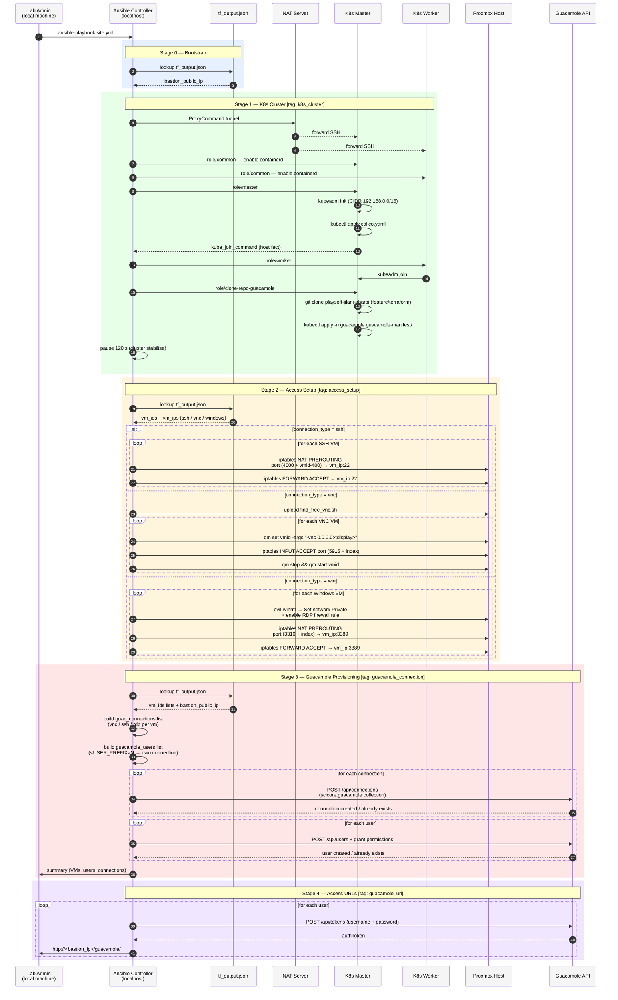
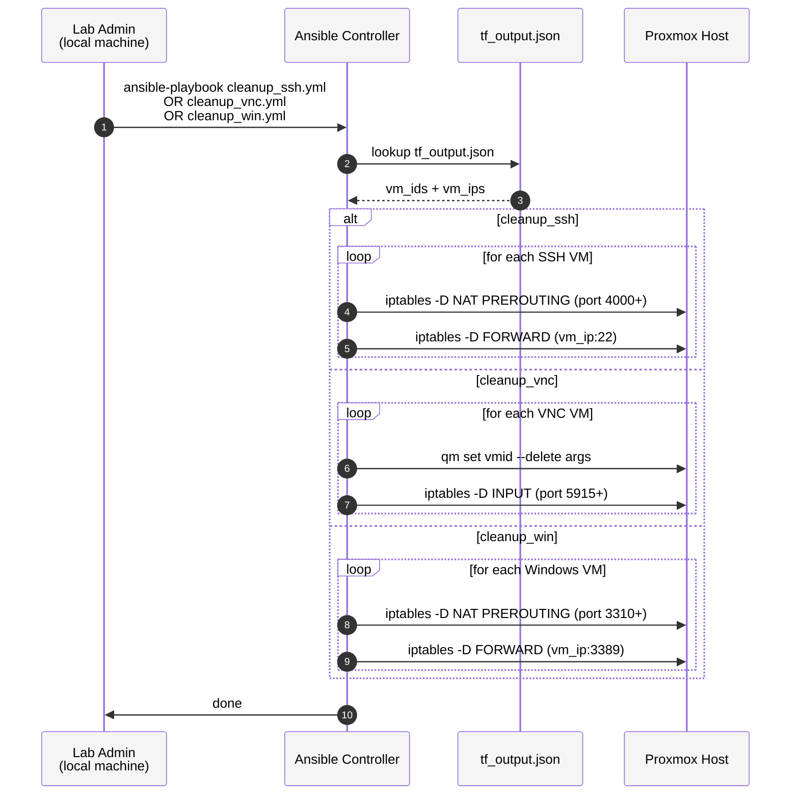

# Sequence Diagram — Global Ansible Flow

```mermaid
%%{init: {'theme': 'default', 'themeVariables': {'background': '#ffffff', 'mainBkg': '#ffffff', 'textColor': '#000000', 'actorTextColor': '#000000', 'actorBkg': '#f5f5f5', 'actorBorderColor': '#333333', 'signalColor': '#333333', 'signalTextColor': '#000000', 'noteTextColor': '#000000', 'noteBkgColor': '#ffffcc', 'noteBorderColor': '#333333', 'loopTextColor': '#000000', 'activationBorderColor': '#333333', 'activationBkgColor': '#e8e8e8', 'sequenceNumberColor': '#ffffff'}}}%%
sequenceDiagram
    autonumber
    participant Op as Lab Admin<br/>(local machine)
    participant AC as Ansible Controller<br/>(localhost)
    participant TF as tf_output.json
    participant NAT as NAT Server
    participant Master as K8s Master
    participant Worker as K8s Worker
    participant PVE as Proxmox Host
    participant GUAC as Guacamole API

    Op->>AC: ansible-playbook site.yml

    %% ── Stage 0 : Bootstrap ─────────────────────────────────────
    rect rgb(230, 240, 255)
        Note over AC,TF: Stage 0 — Bootstrap
        AC->>TF: lookup tf_output.json
        TF-->>AC: bastion_public_ip
    end

    %% ── Stage 1 : K8s Cluster ───────────────────────────────────
    rect rgb(230, 255, 230)
        Note over AC,Worker: Stage 1 — K8s Cluster [tag: k8s_cluster]

        AC->>NAT: ProxyCommand tunnel
        NAT-->>Master: forward SSH
        NAT-->>Worker: forward SSH

        AC->>Master: role/common — enable containerd
        AC->>Worker: role/common — enable containerd

        AC->>Master: role/master
        Master->>Master: kubeadm init (CIDR 192.168.0.0/16)
        Master->>Master: kubectl apply calico.yaml
        Master-->>AC: kube_join_command (host fact)

        AC->>Worker: role/worker
        Worker->>Master: kubeadm join

        AC->>Master: role/clone-repo-guacamole
        Master->>Master: git clone playsoft-jilani-gharbi (feature/terraform)
        Master->>Master: kubectl apply -n guacamole guacamole-manifest/

        AC->>AC: pause 120 s (cluster stabilise)
    end

    %% ── Stage 2 : Access Setup ──────────────────────────────────
    rect rgb(255, 245, 220)
        Note over AC,PVE: Stage 2 — Access Setup [tag: access_setup]
        AC->>TF: lookup tf_output.json
        TF-->>AC: vm_ids + vm_ips (ssh / vnc / windows)

        alt connection_type = ssh
            loop for each SSH VM
                AC->>PVE: iptables NAT PREROUTING<br/>port (4000 + vmid-400) → vm_ip:22
                AC->>PVE: iptables FORWARD ACCEPT → vm_ip:22
            end
        else connection_type = vnc
            AC->>PVE: upload find_free_vnc.sh
            loop for each VNC VM
                AC->>PVE: qm set vmid -args "-vnc 0.0.0.0:<display>"
                AC->>PVE: iptables INPUT ACCEPT port (5915 + index)
                AC->>PVE: qm stop && qm start vmid
            end
        else connection_type = win
            loop for each Windows VM
                AC->>PVE: evil-winrm → Set network Private<br/>+ enable RDP firewall rule
                AC->>PVE: iptables NAT PREROUTING<br/>port (3310 + index) → vm_ip:3389
                AC->>PVE: iptables FORWARD ACCEPT → vm_ip:3389
            end
        end
    end

    %% ── Stage 3 : Guacamole Connections ─────────────────────────
    rect rgb(255, 230, 230)
        Note over AC,GUAC: Stage 3 — Guacamole Provisioning [tag: guacamole_connection]
        AC->>TF: lookup tf_output.json
        TF-->>AC: vm_ids lists + bastion_public_ip

        AC->>AC: build guac_connections list<br/>(vnc / ssh / rdp per vm)
        AC->>AC: build guacamole_users list<br/>(<USER_PREFIX>N → own connection)

        loop for each connection
            AC->>GUAC: POST /api/connections<br/>(scicore.guacamole collection)
            GUAC-->>AC: connection created / already exists
        end

        loop for each user
            AC->>GUAC: POST /api/users + grant permissions
            GUAC-->>AC: user created / already exists
        end

        AC->>Op: summary (VMs, users, connections)
    end

    %% ── Stage 4 : Print URLs ─────────────────────────────────────
    rect rgb(240, 230, 255)
        Note over AC,GUAC: Stage 4 — Access URLs [tag: guacamole_url]

        loop for each user
            AC->>GUAC: POST /api/tokens (username + password)
            GUAC-->>AC: authToken
            AC->>Op: http://<bastion_ip>/guacamole/#/?token=<authToken>
        end
    end
```

---

## Cleanup Flows

```mermaid
%%{init: {'theme': 'default', 'themeVariables': {'background': '#ffffff', 'mainBkg': '#ffffff', 'textColor': '#000000', 'actorTextColor': '#000000', 'actorBkg': '#f5f5f5', 'actorBorderColor': '#333333', 'signalColor': '#333333', 'signalTextColor': '#000000', 'noteTextColor': '#000000', 'noteBkgColor': '#ffffcc', 'noteBorderColor': '#333333', 'loopTextColor': '#000000', 'activationBorderColor': '#333333', 'activationBkgColor': '#e8e8e8', 'sequenceNumberColor': '#ffffff'}}}%%
sequenceDiagram
    autonumber
    participant Op as Lab Admin<br/>(local machine)
    participant AC as Ansible Controller
    participant TF as tf_output.json
    participant PVE as Proxmox Host

    Op->>AC: ansible-playbook cleanup_ssh.yml<br/>OR cleanup_vnc.yml<br/>OR cleanup_win.yml

    AC->>TF: lookup tf_output.json
    TF-->>AC: vm_ids + vm_ips

    alt cleanup_ssh
        loop for each SSH VM
            AC->>PVE: iptables -D NAT PREROUTING (port 4000+)
            AC->>PVE: iptables -D FORWARD (vm_ip:22)
        end
    else cleanup_vnc
        loop for each VNC VM
            AC->>PVE: qm set vmid --delete args
            AC->>PVE: iptables -D INPUT (port 5915+)
        end
    else cleanup_win
        loop for each Windows VM
            AC->>PVE: iptables -D NAT PREROUTING (port 3310+)
            AC->>PVE: iptables -D FORWARD (vm_ip:3389)
        end
    end

    AC->>Op: done
```
