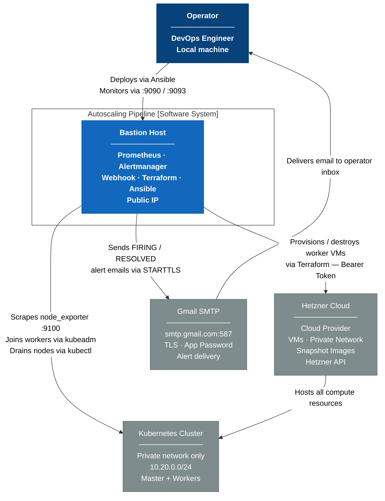
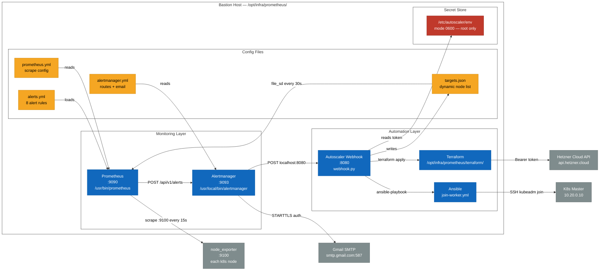
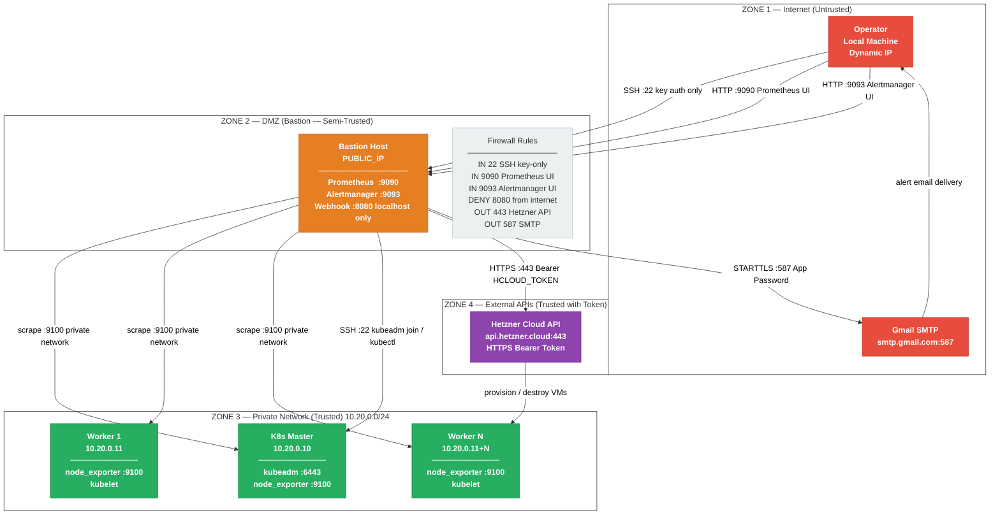
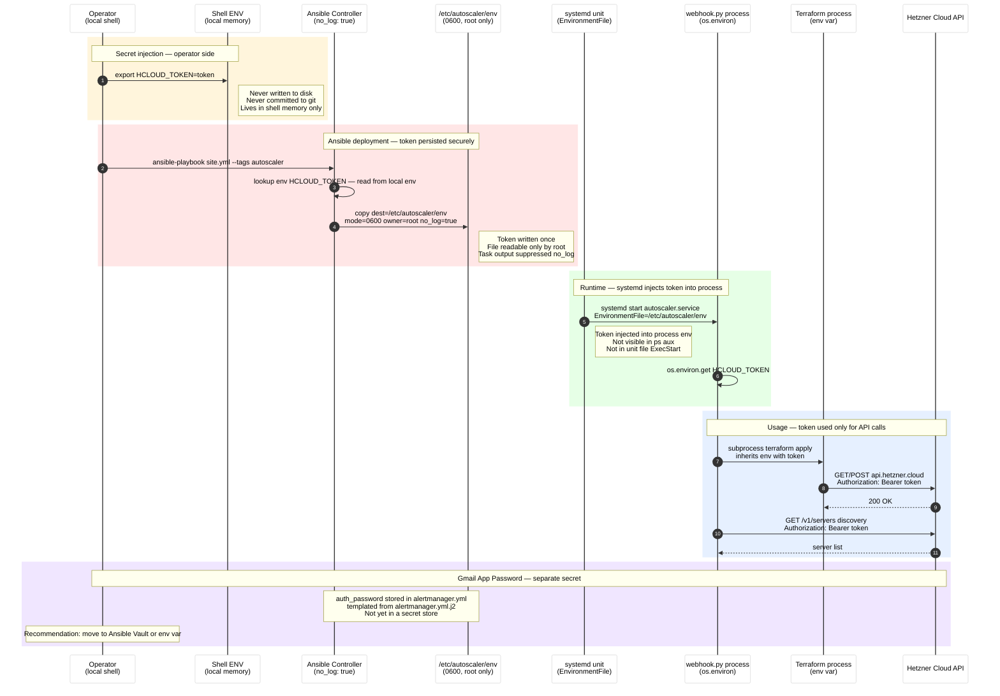
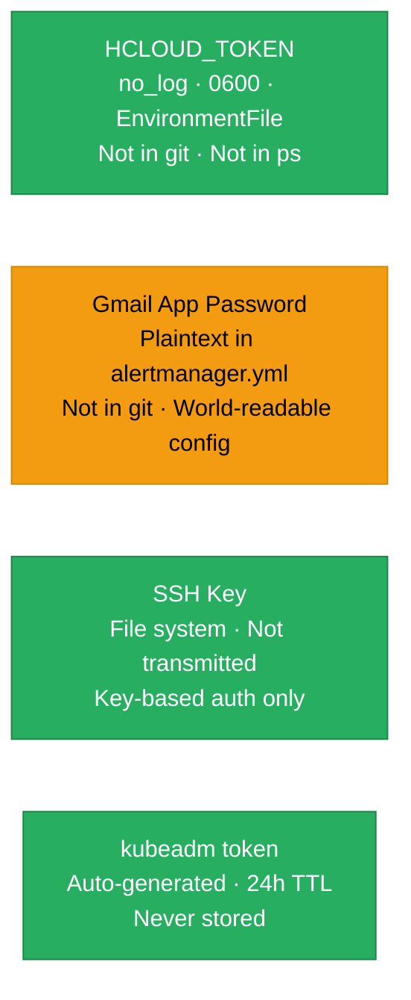
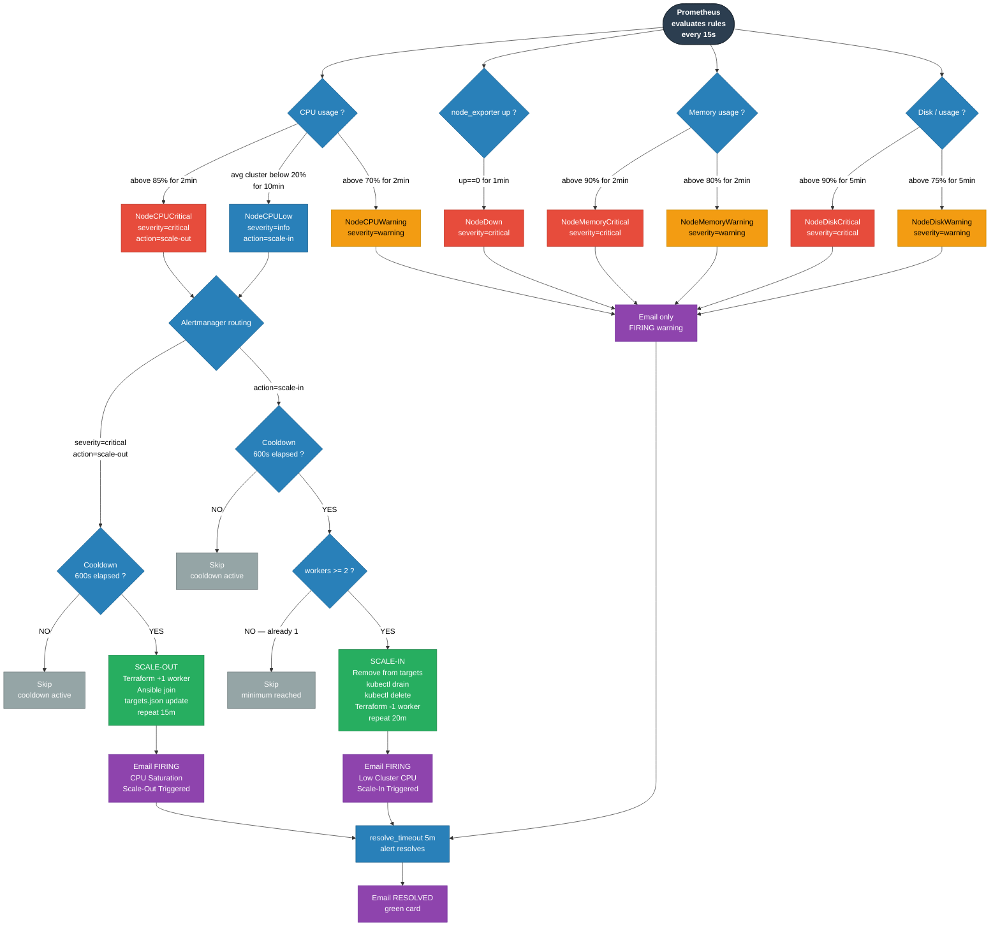

# Cloud DevSecOps Report — Prometheus Autoscaling Pipeline

> **Project:** Kubernetes Auto-Scaling on Hetzner Cloud
> **Stack:** Prometheus · Alertmanager · Python Webhook · Terraform · Ansible
> **Scope:** Monitoring, alerting, automated horizontal scaling, secret management
> **Skill applied:** `mermaid-devsecops` — see `skills/mermaid-devsecops/SKILL.md`

---

## Table of Contents

1. [C4 Architecture](#1-c4-architecture)
2. [Network Security Zones](#2-network-security-zones)
3. [Secret Management Flow](#3-secret-management-flow)
4. [Alert Decision Tree](#4-alert-decision-tree)
5. [Security Controls Summary](#5-security-controls-summary)
6. [Risk Register](#6-risk-register)

---

## 1. C4 Architecture

### Level 1 — System Context

Who interacts with the system and what external dependencies exist.

---

### Level 2 — Container Diagram (Bastion Host)

Internal components and how they communicate.

---

## 2. Network Security Zones

---

### Network Exposure Table

| Port | Service | Exposed To | Auth Method | Risk |
|---|---|---|---|---|
| `22` | SSH | Internet | SSH key pair only | Low |
| `9090` | Prometheus UI | Internet | None | Medium — no auth |
| `9093` | Alertmanager UI | Internet | None | Medium — no auth |
| `8080` | Autoscaler Webhook | **localhost only** | None (internal) | Low — not routable |
| `9100` | node_exporter | Private network only | None | Low — isolated |
| `6443` | Kubernetes API | Private network only | kubeadm token | Low — isolated |
| `443` | Hetzner Cloud API | Outbound only | Bearer token | Low |
| `587` | Gmail SMTP | Outbound only | App password TLS | Low |

> **Recommendation:** Add IP allowlist or reverse proxy with basic auth to restrict `:9090` and `:9093`.

---

## 3. Secret Management Flow

---

### Secret Inventory

| Secret | Storage | Transit | At Rest | Rotation |
|---|---|---|---|---|
| `HCLOUD_TOKEN` | `/etc/autoscaler/env` (0600) | Shell env → Ansible (no_log) | 0600, root only | Manual on Hetzner dashboard |
| `GMAIL_APP_PASSWORD` | `alertmanager.yml` (plaintext) | Ansible template | World-readable config | Manual on Google account |
| SSH Private Key | `/root/.ssh/<SSH_KEY_NAME>` | Not transmitted | File system | Manual |
| `kubeadm join token` | Memory only | SSH channel | Never persisted | Auto-expires 24h |

### Secret Security Levels

---

## 4. Alert Decision Tree

---

### Alert Routing Summary

| Alert | Severity | Webhook | Email | Repeat Interval |
|---|---|---|---|---|
| `NodeCPUCritical` | critical | scale-out | yes | 15m |
| `NodeCPULow` | info | scale-in | yes | 20m |
| `NodeCPUWarning` | warning | no | yes | 15m |
| `NodeDown` | critical | no | yes | 15m |
| `NodeMemoryCritical` | critical | no | yes | 15m |
| `NodeMemoryWarning` | warning | no | yes | 15m |
| `NodeDiskCritical` | critical | no | yes | 15m |
| `NodeDiskWarning` | warning | no | yes | 15m |

---

## 5. Security Controls Summary

| Control | Status | Detail |
|---|---|---|
| **Secret at rest** | ✅ | `HCLOUD_TOKEN` in `/etc/autoscaler/env` mode 0600, root only |
| **Secret in transit** | ✅ | Ansible `no_log: true`, never in stdout/logs |
| **Secret in process** | ✅ | `EnvironmentFile` — not in `ExecStart`, not in `ps aux` |
| **Secret in git** | ✅ | Token never committed — read from local `export` at deploy time |
| **SSH authentication** | ✅ | Key-pair only, no password auth |
| **API communication** | ✅ | Hetzner API over HTTPS, Gmail over STARTTLS |
| **Network isolation** | ✅ | Workers on private network `10.20.0.0/24`, no public IP |
| **kubeadm token TTL** | ✅ | Auto-generated per join, expires 24h |
| **Webhook exposure** | ✅ | Webhook `:8080` bound to `localhost` only |
| **Prometheus/AM UI auth** | ⚠️ | No authentication — exposed on public IP |
| **Gmail password storage** | ⚠️ | Plaintext in `alertmanager.yml` — not yet in Ansible Vault |
| **Token rotation** | ⚠️ | No automated rotation — manual process on Hetzner dashboard |
| **Audit logging** | ⚠️ | `journalctl` only — no centralized log shipping |
| **RBAC on kubectl** | ❌ | Webhook uses `root` SSH + full `kubectl` — no scoped ServiceAccount |

---

## 6. Risk Register

| ID | Risk | Likelihood | Impact | Mitigation |
|---|---|---|---|---|
| R1 | `HCLOUD_TOKEN` leaked via git | Low | Critical | Token not in repo; `no_log: true` in Ansible |
| R2 | Gmail app password exposed in config | Medium | High | Move to Ansible Vault or env var |
| R3 | Prometheus/Alertmanager UI open to internet | Medium | Medium | Add IP allowlist or reverse proxy with basic auth |
| R4 | Runaway scale-out — billing risk | Low | High | 600s cooldown between operations |
| R5 | False NodeDown on provisioning | Low | Medium | Health-check guard in `sync_loop` before adding to targets |
| R6 | Scale-in removes wrong node | Low | High | Always removes last IP `WORKER_BASE_IP + count - 1` |
| R7 | Ansible overwrites live `targets.json` | Medium | Medium | `sync_loop` reconciles within 60s after playbook run |
| R8 | SSH key compromise on bastion | Low | Critical | Key not in repo; bastion has no password auth |
| R9 | No RBAC — webhook runs as root | Medium | High | Future: create scoped `kubectl` ServiceAccount |
