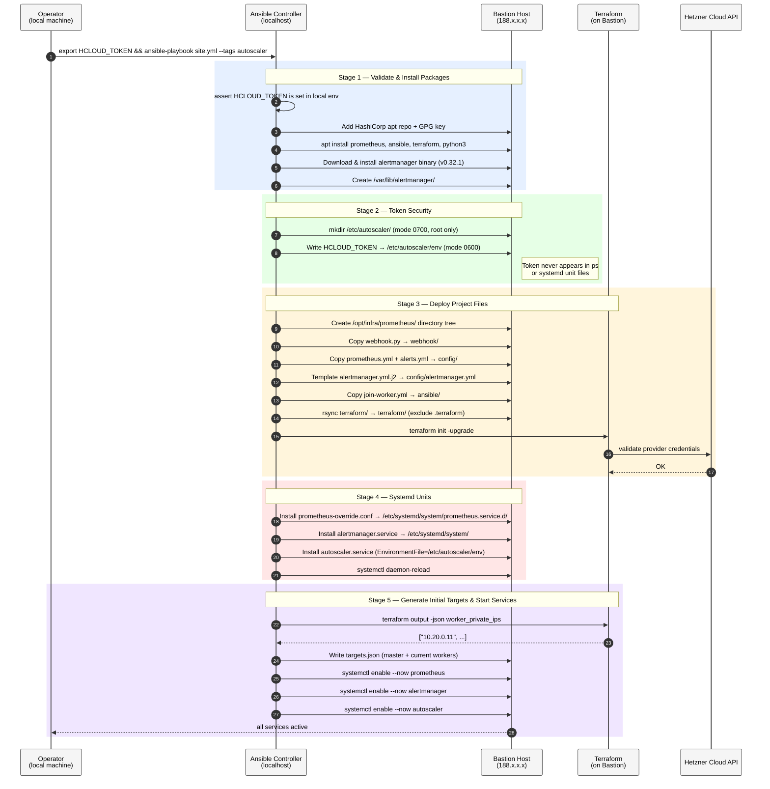
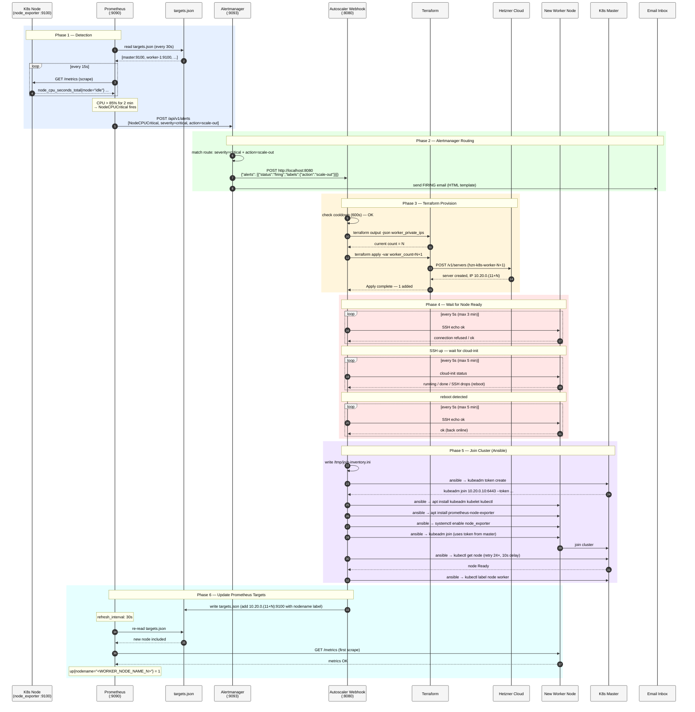
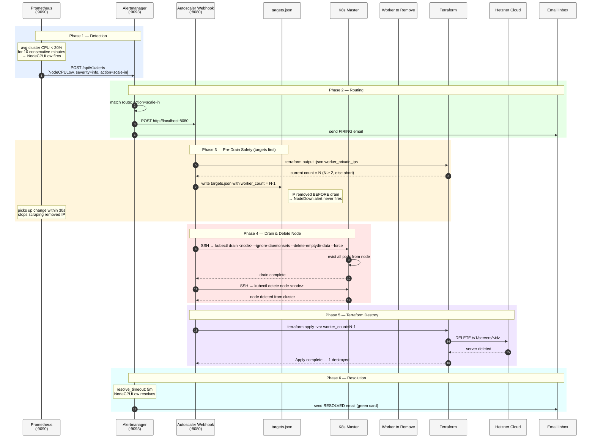
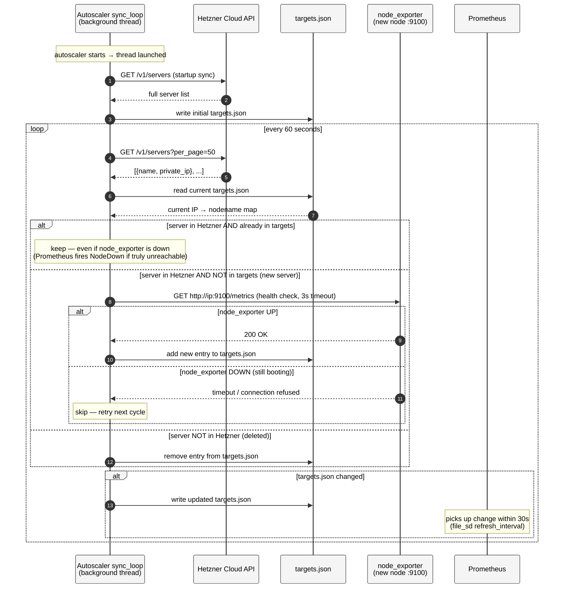
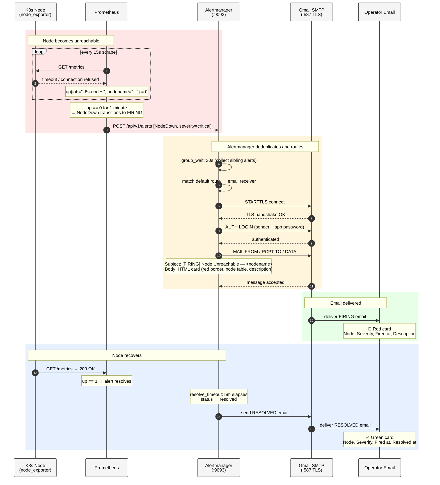

# Sequence Diagram — Prometheus Autoscaling Pipeline

---

## Diagram 1 — Ansible Deployment (autoscaler role)

---

### Stage-by-stage Explanation — Deployment

| # | Description |
|---|---|
| 1 | Operator exports `HCLOUD_TOKEN` in their shell and runs the Ansible playbook targeting the `bastion` group with tag `autoscaler`. |
| 2 | Ansible asserts the token is present on the control node before touching the bastion — fails fast if missing. |
| 3 | HashiCorp apt repository and GPG key are added to the bastion so Terraform can be installed via apt. |
| 4 | Core packages installed: `prometheus` (apt), `ansible`, `terraform`, `python3`. |
| 5 | Alertmanager v0.32.1 binary is downloaded from GitHub releases and placed at `/usr/local/bin/alertmanager`. |
| 6 | Alertmanager storage directory created at `/var/lib/alertmanager/`. |
| 7 | `/etc/autoscaler/` directory created with mode `0700` — only root can enter it. |
| 8 | Token written to `/etc/autoscaler/env` with mode `0600`. Ansible uses `no_log: true` on this task so the value never appears in logs. |
| 9 | `/opt/infra/prometheus/` directory tree created with sub-dirs: `webhook/`, `config/`, `ansible/`, `terraform/`. |
| 10 | `webhook.py` copied to `webhook/`. |
| 11 | `prometheus.yml` and `alerts.yml` copied to `config/`. |
| 12 | `alertmanager.yml.j2` is rendered (Jinja2 → YAML) and written to `config/alertmanager.yml`. |
| 13 | `join-worker.yml` Ansible playbook copied to `ansible/`. |
| 14 | Terraform files synced from local machine to bastion with `rsync` (`.terraform/` excluded to avoid uploading provider binaries). |
| 15 | `terraform init -upgrade` runs on the bastion to download the Hetzner provider. |
| 16 | Terraform validates credentials against the Hetzner Cloud API. |
| 17 | Prometheus systemd override installed — points `--config.file` to `/opt/infra/prometheus/config/prometheus.yml` instead of the apt default. |
| 18 | `alertmanager.service` unit installed pointing to the project config directory. |
| 19 | `autoscaler.service` unit installed with `EnvironmentFile=/etc/autoscaler/env` — the token is injected at runtime, not baked in. |
| 20 | `systemctl daemon-reload` picks up all new unit files. |
| 21 | Ansible reads current worker IPs from Terraform output to generate an accurate initial `targets.json`. |
| 22 | Terraform returns the list of worker private IPs from state. |
| 23 | `targets.json` written with one entry per node (master + workers), each with a `nodename` label. |
| 24–26 | All three services are enabled and started. The `autoscaler` service immediately starts the background Hetzner discovery thread. |

---

## Diagram 2 — Scale-Out Pipeline (CPU Critical)

---

### Phase-by-phase Explanation — Scale-Out

| # | Description |
|---|---|
| 1 | Prometheus re-reads `targets.json` every 30 seconds to discover the current list of nodes to scrape. |
| 2 | `targets.json` returns one entry per node, each with a `nodename` label for human-readable alerts. |
| 3–4 | Every 15 seconds Prometheus scrapes `node_exporter` on each node and stores CPU metrics. |
| 5 | After CPU stays above 85% for 2 consecutive minutes, the `NodeCPUCritical` alert transitions to **firing**. |
| 6 | Prometheus pushes the alert to Alertmanager via its internal API. |
| 7 | Alertmanager matches the alert against the route `severity=critical + action=scale-out` and selects the `autoscaler` receiver. |
| 8 | Alertmanager sends an HTTP POST to the autoscaler webhook on `localhost:8080`. |
| 9 | Alertmanager also sends a FIRING email to the operator using the HTML template. |
| 10 | The webhook checks the 600-second cooldown — rejects if a scale happened within the last 10 minutes. |
| 11–12 | `terraform output` reads the current worker count from Terraform state. |
| 13 | `terraform apply -var worker_count=N+1` is run — Terraform calculates the diff and creates one new server. |
| 14 | Hetzner Cloud provisions the new server with a deterministic private IP (`10.20.0.11`, `.12`, etc.). |
| 15 | Terraform reports success. |
| 16–17 | The webhook polls SSH on the new IP every 5 seconds until it responds (the server needs ~30s to boot). |
| 18–19 | `cloud-init status` is polled — when SSH drops it means a reboot was triggered by cloud-init's final step. |
| 20–21 | After the reboot, SSH is polled again until the node comes back. |
| 22 | A temporary Ansible inventory file is written to `/tmp/join-inventory.ini` with the master and new worker. |
| 23–24 | Ansible connects to the master and runs `kubeadm token create` to get a fresh join command. |
| 25–27 | On the new worker: `kubeadm`, `kubelet`, `kubectl`, and `prometheus-node-exporter` are installed and `node_exporter` is enabled. |
| 28–29 | The worker runs `kubeadm join` and connects to the master control plane. |
| 30–31 | Ansible waits up to 4 minutes (24 retries × 10s) for `kubectl get node` to succeed. |
| 32 | The node is labelled `node-role.kubernetes.io/worker=worker`. |
| 33 | `webhook.py` updates `targets.json` adding the new node's IP and `nodename` label. |
| 34–36 | Within 30 seconds Prometheus re-reads `targets.json`, discovers the new target, and begins scraping it. |

---

## Diagram 3 — Scale-In Pipeline (Low CPU)

---

### Phase-by-phase Explanation — Scale-In

| # | Description |
|---|---|
| 1 | Prometheus evaluates the cluster-wide average CPU across all `k8s-nodes` targets. When it stays below 20% for 10 consecutive minutes, `NodeCPULow` fires. |
| 2 | The alert is pushed to Alertmanager. |
| 3 | Alertmanager matches the route `action=scale-in` and sends to the `autoscaler` webhook (repeat interval: 20 minutes). |
| 4 | A FIRING email is sent to the operator. |
| 5–6 | The webhook reads current worker count from Terraform state. If count ≤ 1, the scale-in is aborted — the cluster always keeps at least 1 worker. |
| 7 | **Critical safety step:** the worker's IP is removed from `targets.json` *before* the node is drained. This prevents Prometheus from firing `NodeDown` while the drain is in progress. |
| 8 | Within 30 seconds Prometheus stops scraping the removed IP. |
| 9 | `kubectl drain` gracefully evicts all user pods from the target node. DaemonSet pods and local-storage pods are force-removed. |
| 10 | Drain completes successfully. If drain fails, the webhook rolls back by re-adding the IP to `targets.json` and returns `False`. |
| 11 | `kubectl delete node` removes the node object from the Kubernetes API server. |
| 12 | `terraform apply -var worker_count=N-1` is run — Terraform destroys the last worker VM. |
| 13 | Hetzner Cloud deletes the server. |
| 14 | Terraform reports the destroy is complete. |
| 15 | After `resolve_timeout: 5m`, Alertmanager marks `NodeCPULow` as resolved and sends a green RESOLVED email. |

---

## Diagram 4 — Background Node Discovery (sync_loop)

---

### Step-by-step Explanation — sync_loop

| # | Description |
|---|---|
| 1 | At startup, the webhook immediately calls the Hetzner API and writes an accurate initial `targets.json` before the HTTP server starts. |
| 2–3 | Full server list returned and written to `targets.json`. |
| 4 | Every 60 seconds the background thread wakes and calls the Hetzner API. |
| 5 | Returns all servers with their name and private IP. |
| 6–7 | The current `targets.json` is read to build a map of IP → nodename currently being scraped. |
| 8 | **Keep rule:** if the server exists in Hetzner and is already in targets, it stays — even if `node_exporter` is temporarily down. Prometheus handles that case by firing `NodeDown`. |
| 9 | **Add rule:** a new server (in Hetzner but not in targets) is only added after `node_exporter` successfully responds. This prevents `NodeDown` from firing for nodes that are still provisioning. |
| 10–11 | Health check passes — entry added to the merged targets map. |
| 12–13 | Health check fails (node still booting) — skipped, will be retried next cycle in 60 seconds. |
| 14 | **Remove rule:** a server that no longer exists on Hetzner is removed from targets. |
| 15–16 | If the merged targets differ from the current file, `targets.json` is overwritten and Prometheus picks up the change within 30 seconds. |

---

## Diagram 5 — Alert Email Flow (NodeDown)

---

### Step-by-step Explanation — Alert Email

| # | Description |
|---|---|
| 1–3 | Every 15 seconds Prometheus scrapes all targets. When a node's `node_exporter` stops responding, `up` drops to `0`. |
| 4 | After 1 full minute of `up == 0`, the `NodeDown` alert transitions from **pending** to **firing** and is pushed to Alertmanager. |
| 5 | Alertmanager waits `group_wait: 30s` to collect any other alerts that fire at the same time before sending one grouped email. |
| 6 | The alert matches the default route (no `action` label) → routed to the `default` receiver (email). |
| 7–9 | Alertmanager connects to Gmail SMTP on port 587 using STARTTLS and authenticates with the app password from the config. |
| 10 | The email is composed: subject uses `[FIRING] + summary annotation`, body uses the custom HTML template with a **red** left-border card. |
| 11–12 | SMTP accepts the message and delivers it to the operator's inbox. |
| 13–14 | Once the node recovers, `node_exporter` starts responding and `up` returns to `1`. The alert transitions back to **resolved**. |
| 15 | After `resolve_timeout: 5m`, Alertmanager marks the alert resolved and sends a second email. |
| 16–17 | The RESOLVED email is delivered — same HTML template but with a **green** border and a "Resolved at" row in the table. |

---

## Alert Rules Summary

| Alert | Expression | For | Labels | Email | Webhook |
|---|---|---|---|---|---|
| `NodeCPUWarning` | CPU > 70% | 2m | severity=warning | ✅ | ❌ |
| `NodeCPUCritical` | CPU > 85% | 2m | severity=critical, **action=scale-out** | ✅ | ✅ scale-out |
| `NodeCPULow` | avg cluster CPU < 20% | 10m | severity=info, **action=scale-in** | ✅ | ✅ scale-in |
| `NodeDown` | up == 0 | 1m | severity=critical | ✅ | ❌ |
| `NodeMemoryWarning` | RAM > 80% | 2m | severity=warning | ✅ | ❌ |
| `NodeMemoryCritical` | RAM > 90% | 2m | severity=critical | ✅ | ❌ |
| `NodeDiskWarning` | disk `/` > 75% | 5m | severity=warning | ✅ | ❌ |
| `NodeDiskCritical` | disk `/` > 90% | 5m | severity=critical | ✅ | ❌ |
